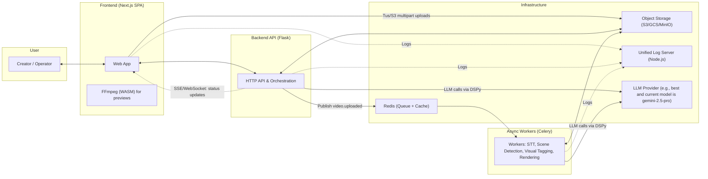

## Product Requirements Document: Project Chronos

*   **Version:** 2.0 (Definitive)
*   **Date:** August 10, 2025
*   **Status:** Approved for Development
*   **Owner:** Product Leadership

### 1. Executive Summary & Vision

**Project Chronos** will redefine the relationship between creators and their content. We are building an AI-native web application that transforms video from a static, linear medium into a dynamic, searchable, and interactive database. Our vision is to eliminate the costly and time-consuming process of manual video review by allowing users to find, analyze, and clip their footage using the power of natural language.

At its core, Chronos is a **Retrieval-Augmented Generation (RAG) system for video**. We will construct a sophisticated pre-processing pipeline to deconstruct videos into rich, time-coded metadata (transcripts, scenes, visual tags, speakers). Users will then interact with this structured data through a simple, conversational interface, enabling them to pinpoint and extract valuable "moments" with 10x the speed and precision of traditional editing workflows.

This document provides the complete functional, non-functional, and strategic requirements for the successful development and launch of Project Chronos Version 1.0.

### 2. The Problem & The Opportunity

Finding specific moments in video is a fundamentally broken process. It is a bottleneck for the entire creator economy, from YouTubers to corporate marketing teams and academic researchers. This manual scrubbing of timelines is **inefficient, imprecise, and expensive**. Content remains a "black box," its value locked away until it is laboriously watched and re-watched.

The opportunity is to build the `Ctrl+F` for video. By creating an intelligent system that understands the *content* and *context* of a video, we empower users to unlock its full potential, enabling rapid content repurposing, data analysis, and creative discovery.

### 3. Guiding Principles

These principles will guide our decisions throughout the development process:

1.  **AI-Native, Not AI-Assisted:** The AI is not a feature; it is the core of the user experience. Every design choice should flow from the question: "How can the AI make this process faster, smarter, and more intuitive?"
2.  **Start Pragmatic, Design for Scale:** We will begin with a robust, modular monolith (as seen in the final codebase) for V1 to ensure rapid development and stability. However, every component will be designed with clear boundaries, anticipating a future migration to a full microservices architecture.
3.  **Developer Experience is User Experience:** A system that is easy to monitor, debug, and deploy is a system that is reliable and improves quickly. We will invest in exceptional tooling, starting with a unified logging system and robust key management.
4.  **Cost is a Feature:** We will be relentless in optimizing our AI pipeline. Every token matters. Our RAG architecture is a strategic choice to minimize expensive LLM calls by providing highly relevant, pre-processed context.

### 4. User Personas

*   **Chloe, the Content Creator:** Needs to find B-roll, funny outtakes, and key discussion points from long-form podcasts to create short-form content for social media.
*   **Mark, the Digital Marketer:** Needs to pull customer testimonials, product mentions, and executive soundbites from hours of webinar recordings for marketing campaigns.
*   **Dr. Evans, the University Researcher:** Needs to find all instances where participants in recorded interviews mention specific keywords or express certain emotions.

### 5. System Architecture Overview (V1)

For Version 1.0, we will implement a **Modular Monolith** to balance development speed with future scalability.

*   **Core Components:**
    *   **Frontend (Next.js):** The user-facing SPA.
    *   **Backend API (Python/Flask):** A single, well-structured service that handles all API requests, authentication, and orchestration logic.
    *   **Asynchronous Workers (Celery):** A pool of workers dedicated to handling long-running, computationally expensive tasks (video processing, AI analysis).
*   **Infrastructure:**
    *   **Task Queue & Caching (Redis):** The message broker between the API and Celery workers, also used for status tracking and caching.
    *   **Object Storage (S3/GCS/MinIO):** A single source of truth for all video assets (original uploads, segments, final clips).
    *   **Unified Log Server (Node.js):** A standalone service to aggregate logs from all components for centralized monitoring.

---

### 6. Functional Requirements (Epics & User Stories)

#### **Epic 1: The Ingestion Pipeline**

*   **Story 1.1: Secure & Resilient File Upload**
    *   **As a user,** I want to upload large video files (MP4, MOV, MKV, etc.) via a drag-and-drop interface.
    *   **Acceptance Criteria:**
        *   The frontend must implement the **Tus protocol** or **S3 multipart uploads** for resumable and reliable transfers.
        *   A clear file size limit of 2GB is displayed.
        *   A real-time progress bar is shown.
        *   Files are streamed directly to Object Storage.
        *   The system performs a basic virus scan on the uploaded file.
        *   Upon completion, a `video.uploaded` event is dispatched to the Celery task queue via Redis.

#### **Epic 2: The Pre-processing & Analysis Engine**

*   **Story 2.1: Asynchronous Multi-Modal Analysis**
    *   **As the system,** upon receiving a `video.uploaded` event, I want to trigger a comprehensive analysis pipeline.
    *   **Acceptance Criteria:**
        *   **Video Segmentation (Orchestration):** If the video duration exceeds a threshold (e.g., 10 minutes), it must first be segmented into smaller, overlapping chunks using FFmpeg.
        *   **Speech-to-Text (STT):** The full audio track is transcribed by a high-accuracy model (e.g., Whisper), producing word-level timestamps.
        *   **Scene Detection:** The video is analyzed to identify the start and end timestamps of every distinct scene.
        *   **Visual Tagging:** Keyframes from each scene are extracted and analyzed to generate descriptive visual tags (e.g., "whiteboard," "person speaking").
        *   All generated metadata is stored and linked to the video ID.

*   **Story 2.2: Real-time Frontend Status Updates**
    *   **As a user,** I want to see granular, real-time progress of my video's analysis (e.g., "Transcribing audio...", "Detecting scenes...").
    *   **Acceptance Criteria:**
        *   The frontend establishes a WebSocket or Server-Sent Events (SSE) connection to a status endpoint.
        *   The backend pushes detailed status updates as the Celery pipeline progresses.

#### **Epic 3: The Momentum Studio (Core UI)**

*   **Story 3.1: The Interactive Player & Transcript**
    *   **As a user,** I want a video player synchronized with a time-coded, searchable transcript.
    *   **Acceptance Criteria:**
        *   The currently spoken word in the transcript is highlighted as the video plays.
        *   Clicking any word in the transcript instantly seeks the video player to that moment.

*   **Story 3.2: The Natural Language Search Interface**
    *   **As a user,** I want to use a simple, chat-like input to find moments in my video.
    *   **Acceptance Criteria:**
        *   The interface supports natural language queries about spoken content, visual elements, or speakers.
        *   Quick suggestion prompts are provided to guide the user.

*   **Story 3.3: The Dynamic Timeline Editor**
    *   **As a user,** I want to see AI-suggested clips on a visual timeline and easily edit them.
    *   **Acceptance Criteria:**
        *   AI-suggested clips appear as distinct, colored regions on the timeline.
        *   Users can play individual clips, adjust their start/end times by dragging, and delete them.
        *   **Instant Previews:** Use **WASM-based FFmpeg** in the browser for client-side previews of clip adjustments, providing immediate feedback without waiting for the server.

#### **Epic 4: The RAG Core (AI Logic)**

*   **Story 4.1: Query Understanding & Data Retrieval (The "R" in RAG)**
    *   **As the system,** I want to analyze a user's query and retrieve the most relevant information from the video's metadata.
    *   **Acceptance Criteria:**
        *   An LLM-powered module, orchestrated by **DSPy**, classifies the user's intent (transcript search, visual search, etc.).
        *   The query is converted into a semantic search against the pre-processed metadata.
        *   The most relevant data snippets (text, tags) and their timestamps are retrieved to be used as context.

*   **Story 4.2: Contextual Synthesis & Generation (The "G" in RAG)**
    *   **As the system,** I want to use the retrieved context to generate a precise and helpful answer.
    *   **Acceptance Criteria:**
        *   The retrieved context and the original query are passed to a powerful LLM (e.g., Gemini 1.5 Pro).
        *   The LLM generates two outputs based *only* on the provided context:
            1.  A JSON array of `start` and `end` timestamps for relevant clips.
            2.  A conversational message explaining its findings.
        *   The response is returned to the frontend for display.

#### **Epic 5: Finalization & Export**

*   **Story 5.1: Asynchronous Video Rendering**
    *   **As a user,** I want to click a "Create Video" button to generate a final video from my selected clips.
    *   **Acceptance Criteria:**
        *   This action triggers an asynchronous Celery task using FFmpeg.
        *   The UI shows a "Rendering..." status.
        *   The final video is saved to object storage.

*   **Story 5.2: Flexible Download Options**
    *   **As a user,** I want to download both the clips I selected and the parts I *didn't* select.
    *   **Acceptance Criteria:**
        *   A "Download Selected Clips" button becomes active upon render completion.
        *   An option to "Download Remaining Clips" is available, triggering a separate render task. This is crucial for users who want to separate B-roll from A-roll.

#### **Epic 6: Operational Excellence**

*   **Story 6.1: Unified Logging System**
    *   **As a developer,** I need a centralized place to view and filter logs from all system components (Frontend, Backend, Celery).
    *   **Acceptance Criteria:**
        *   A standalone Node.js log server aggregates logs via HTTP.
        *   A simple HTML log viewer streams logs in real-time with filtering by level and source.

*   **Story 6.2: Robust API Key Management**
    *   **As an operator,** I need the system to manage multiple API keys to handle rate limits and ensure high availability.
    *   **Acceptance Criteria:**
        *   The system loads multiple `GEMINI_API_KEY`s from environment variables.
        *   A manager class tracks usage and automatically rotates to the next available key upon detecting a rate limit error (HTTP 429).
        *   An internal API endpoint displays the status and usage statistics of all configured keys.

---

### 7. Non-Functional Requirements

*   **Performance:**
    *   Pre-processing pipeline must complete in under **0.5x** the video's duration.
    *   AI search query responses must take less than **5 seconds**.
*   **Scalability:**
    *   The system must be horizontally scalable by adding more Celery workers.
*   **Reliability:**
    *   The system must have an uptime of 99.9%.
    *   Celery tasks must be idempotent and retryable on failure.
*   **Security:**
    *   All user content is private and isolated.
    *   Secrets are managed via environment variables.
    *   All API endpoints are protected against common web vulnerabilities.
*   **Cost-Effectiveness:**
    *   The RAG architecture must be optimized to minimize LLM token consumption. Use the most cost-effective model for each sub-task.

### 8. Success Metrics & KPIs

*   **Time to First Clip:** Average time from video upload completion to the user's first successful clip generation.
*   **User Engagement:** Number of clips generated per user session.
*   **AI Suggestion Acceptance Rate:** Percentage of AI-suggested clips that are kept by the user in the final export.
*   **Processing Efficiency:** Average processing time per video minute.
*   **Cost Efficiency:** Average cloud/API cost per video hour processed.

### 9. Phased Rollout & Future Roadmap (Post-V1)

*   **Version 1.0 (Current Scope):**
    *   All features detailed in this document.

*   **Version 1.5 (Fast Follow):**
    *   **Continuous Improvement Loop:** Implement a user feedback mechanism ("Was this clip helpful?") to collect data for fine-tuning the DSPy orchestration models automatically.
    *   **Multi-Language Support:** Expand STT and AI models to support Spanish, French, and German based on user demand.
    *   **Advanced Timeline Editing:** Introduce features like splitting clips and merging adjacent clips.

*   **Version 2.0 (The Platform):**
    *   **Team Collaboration:** Allow multiple users to collaborate on the same video project.
    *   **AI-Powered B-Roll Suggester:** Proactively suggest relevant clips from a user's *entire library* to enrich their current project.
    *   **Public API:** Expose our core analysis and clipping engine as a public, metered API for developers.